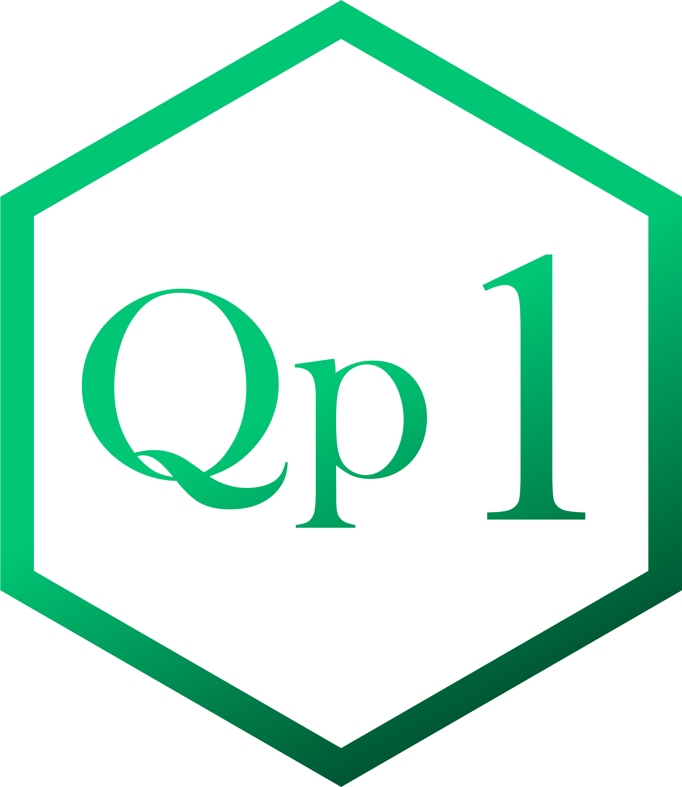

=========================================================================
# Mineração de Commits em Projetos de Software Públicos
### Classificação, Avaliação e Contextualização de Commits com Propósitos Claros ou Indefinidos 
=========================================================================

> [!NOTE]
> ## **[MAIQUEL GOMES](https://github.com/maiquelfx)**</br>
> Mestrando no Departamento de Computação </br>
> Universidade Federal Fluminense (UFF) </br>
> Niterói 24210-346, Brasil </br>
> maiquelgomes@id.uff.br </br>

## ABOUT
</br>
O registro de commits em sistemas Git é essencial no gerenciamento de projetos de software. No entanto, commits sem propósito claro podem comprometer a qualidade do projeto. Para resolver esse problema, este trabalho propõe uma biblioteca em linguagem de programação que classifica commits por propósito e identifica commits vazios ou mal definidos, facilitando a análise do histórico do projeto e a resolução de problemas. Além da implementação, foi realizada uma análise estatística dos dados coletados para entender melhor o contexto dos commits. Além disso, os resultados preliminares indicam que a biblioteca, após fazer o processo de análise e filtragem, consegue identificar com eficiência commits que requerem atenção e a análise estatística identifica padrões e dados que podem ser úteis para melhorias contínuas no processo de desenvolvimento.
</br><p></p>

## QUESTÕES DE PESQUISA

<table>
<thead>
<tr>
<th width="2000" colspan="2">
</th>
</tr>
</thead>
<tbody>
<tr>
  <td width="80" align="center" valign="top">
    <br>
    </a>
  </td>
  <td valign="top">
    <p>
</br>Como a classificação automatizada de commits em categorias, incluindo a detecção de commits sem propósito claro, pode aprimorar a qualidade e a precisão do controle de versão em projetos de desenvolvimento de software?
    </p>
  </td>
</tr>
<tr>
  <td width="80" align="center" valign="top">
    <br>
    </a>
  </td>
  <td valign="top">
    <p>
      </br>Como a análise contextual detalhada dos commits em repositórios Git pode revelar padrões e insights que podem aprimorar o gerenciamento e a qualidade dos projetos de desenvolvimento de software?
    </p>
  </td>
</tr>
</tbody>
</table>

=========================================================================

## Dependências

- GitPython
- graphviz
- git-graph
- shutil
- os
- regex 
- pandas 
- datetime
- git // Repo, GitCommandError
- numpy -
- plotly // express 
- openpyxl // load_workbook
- openpyxl //styles -> PatternFill
- copy
- zipfile
- google.colab // files
- subprocess
- requests

## Funções
>
### Função para mineração de repositórios
```python
prospect()
```
> [!IMPORTANT]
>  As características do repositório, como número de estrelas e de commits estarão definidas no corpo da função. 

### Definir repositório de trabalho
```python
repo()
```
> [!IMPORTANT]
> Deve ser feito da seguinte forma: proprietário/repositório. Ex.: Google/Drive

### Limpar todos os arquivos na pasta de trabalho, seja local ou remota
```python
clear()
```
### Clonar repositório
```python
clone()
```
### Mineração de commits
```python
mining()
```
### Aplicar categorias em cada um dos commits minerados, adicionando uma cor para cada categoria
```python
cat_color(f'{nome}.xlsx', f'{nome}_class_color.xlsx')
```
> [!TIP]
> Categorias
```python
CORRECTIVE_ENGINEERING
FORWARD_ENGINEERING
REENGINEERING
MANAGEMENT
TESTS
UNCLASSIFIED
```
### Classificar commits por categoria
```python
cat_class_color()
```

### Classificar commits alternando em cada categoria
```python
cat_shuffle_color()
```
> [!TIP]
> Isso facilita a conferência manual de classificação dos commits.

### Geração de visualização web resumida e organizada em tópicos.
```python
data_color_html(nome)
```
### Geração de visualização local resumida e organizada em tópicos.
```python
data_color_txt(nome)
```
### Geração de arquivo de dados contendo todos os arquivos e linguagens de programação utilizadas.
```python
lang()
```
### Geração de pasta com o nome do repositório para mover todos os arquivos gerados para tal. 
```python
gerar_pasta(nome)
```
### Geração de arquivo compactado com todos os arquivos gerados a partir de um repositório.
```python
creat_zip()
```

### Função para fazer download de todos os arquivos gerados em virtude da mineração para a máquina local.
```python
download()
```
### Geração de gráfico de dispersão dinâmico, contendo commits, data, hora, local, categoria entre outras informações.
```python
graph()
```

## Projetos selecionados:
| Projeto         | Descrição                                                                        |
|-----------------|----------------------------------------------------------------------------------|
| algorithms      | Estrutura de Dados e Algoritmos Pythonic                                          |
| autojump        | Explorador de Arquivos                                                           |
| ddia            | Aplicativos para uso intensivo de dados                                           |
| FastChat        | Plataforma aberta para treinar chatbots baseados em LLM                           |
| NLP-progress    | Acompanhamento de progresso no processamento de linguagem natural (NLP)           |
| OpenDevin       | Plataforma para engenheiros de software autônomos, alimentada por IA e LLMs       |
| prophet         | Previsão de dados de séries temporais                                             |
| python-patterns | Coleção de padrões de design e expressões idiomáticas em Python                   |
| twint           | Ferramenta para extração de tweets no X sem API                                   |
| typer           | Biblioteca para construir aplicativos CLI                                         |


## Apendice A: Contagem de Commits | Tabela A1

| Classificação          | algorithms | autojump | ddia | FastChat | NLP-progress | OpenDevin | prophet | python-patterns | twint | typer | TOTAL | MÉDIA      | DP         |
|------------------------|------------|----------|------|----------|--------------|-----------|---------|-----------------|-------|-------|-------|------------|------------|
| MANAGEMENT             | 97         | 156      | 162  | 73       | 80           | 69        | 129     | 106             | 102   | 38    | 1012  | 101,2      | 37,13435067|
| FORWARD_ENGINEERING    | 620        | 447      | 337  | 495      | 570          | 678       | 396     | 487             | 392   | 208   | 4630  | 463        | 132,1400772|
| CORRECTIVE_ENGINEERING | 114        | 122      | 115  | 112      | 71           | 156       | 132     | 107             | 144   | 53    | 1126  | 112,6      | 29,42176065|
| REENGINEERING          | 116        | 60       | 111  | 83       | 48           | 60        | 76      | 108             | 146   | 11    | 819   | 81,9       | 37,37766713|
| REALEASES              | 3          | 36       | 5    | 49       | 8            | 171       | 57      | 1               | 49    | 287   | 666   | 66,6       | 87,57876455|
| UNCLASSIFIED           | 8          | 18       | 112  | 7        | 14           | 5         | 6       | 12              | 12    | 0     | 194   | 19,4       | 31,24483957|
| TESTS                  | 0          | 2        | 0    | 2        | 1            | 4         | 4       | 21              | 0     | 1     | 35    | 3,5        | 6,004165221|
| TOTAL                  | 958        | 841      | 842  | 821      | 792          | 1074      | 800     | 842             | 845   | 598   | 8482  |            |            |

## Apendice B: Probabilidade | Tabela B1: Probabilidade de ocorrência
| Classificação          | algorithms  | autojump   | ddia       | FastChat    | NLP-progress | OpenDevin  | prophet    | python-patterns | twint      | typer       | Média       | DP          |
|------------------------|-------------|------------|------------|-------------|--------------|------------|------------|-----------------|------------|-------------|-------------|-------------|
| MANAGEMENT             | 0.10125261  | 0.18549346 | 0.19239905 | 0.088915956 | 0.101010101  | 0.06424581 | 0.16125    | 0.125890736     | 0.120710059| 0.063545151 | 0.120471293 | 0.043862901 |
| FORWARD_ENGINEERING    | 0.647181628 | 0.531510107| 0.40023753 | 0.602923264 | 0.71969697   | 0.631284916| 0.495      | 0.578384798     | 0.463905325| 0.347826087 | 0.541795063 | 0.110392112 |
| CORRECTIVE_ENGINEERING | 0.118997912 | 0.145065398| 0.136579572| 0.136419001 | 0.089646465  | 0.145251397| 0.165      | 0.127078385     | 0.170414201| 0.088628763 | 0.132308109 | 0.02611258  |
| REENGINEERING          | 0.121085595 | 0.071343639| 0.131828979| 0.101096224 | 0.060606061  | 0.055865922| 0.095      | 0.128266033     | 0.172781065| 0.018394649 | 0.095626817 | 0.042859086 |
| REALEASES              | 0.003131524 | 0.042806183| 0.005938242| 0.059683313 | 0.01010101   | 0.159217877| 0.07125    | 0.001187648     | 0.057988166| 0.47993311  | 0.089123707 | 0.13792677  |
| UNCLASSIFIED           | 0.008350731 | 0.021403092| 0.133016627| 0.008526188 | 0.017676768  | 0.004655493| 0.0075     | 0.014251781     | 0.014201183| 0          | 0.022958186 | 0.03717303  |
| TESTS                  | 0           | 0.002378121| 0          | 0.002436054 | 0.001262626  | 0.003724395| 0.005      | 0.024940618     | 0          | 0.001672241 | 0.004141405 | 0.007108963 |

## Apendice B: Probabilidade | Tabela B2: Distância percentual unitária em relação à média  
| Classificação          | algorithms     | autojump       | ddia           | FastChat       | NLP-progress   | OpenDevin      | prophet        | python-patterns | twint          | typer          |
|------------------------|----------------|----------------|----------------|----------------|----------------|----------------|----------------|-----------------|----------------|----------------|
| MANAGEMENT             | -0.019218684   | 0.065022167    | 0.071927757    | -0.031555337   | -0.019461192   | -0.056225483   | 0.040778707    | 0.005419443     | 0.000238766    | -0.056926143   |
| FORWARD_ENGINEERING    | 0.105386566    | -0.010284956   | -0.141557533   | 0.061128202    | 0.177901907    | 0.089489854    | -0.046795063   | 0.036589736     | -0.077889737   | -0.193968976   |
| CORRECTIVE_ENGINEERING | -0.013310197   | 0.012757289    | 0.004271463    | 0.004110892    | -0.042661645   | 0.012943287    | 0.032691891    | -0.005229725    | 0.038106092    | -0.043679347   |
| REENGINEERING          | 0.025458778    | -0.024283178   | 0.036202162    | 0.005469408    | -0.035020756   | -0.039760895   | -0.000626817   | 0.032639217     | 0.077154249    | -0.077232168   |
| REALEASES              | -0.085992183   | -0.046317524   | -0.083185465   | -0.029440394   | -0.079022697   | 0.07009417     | -0.017873707   | -0.087936059    | -0.031135542   | 0.390809403    |
| UNCLASSIFIED           | -0.014607456   | -0.001555095   | 0.110058441    | -0.014431999   | -0.005281419   | -0.018302693   | -0.015458186   | -0.008706405    | -0.008757003   | -0.022958186   |
| TESTS                  | -0.004141405   | -0.001763284   | -0.004141405   | -0.001705352   | -0.002878779   | -0.000417011   | 0.000858595    | 0.020799212     | -0.004141405   | -0.002469165   |

## Apêndice C: Linguagens de programação | Tabela C1
| Linguagens    | algorithms | autojump | ddia | FastChat | NLP-progress | OpenDevin | prophet | python-patterns | twint | typer |
|---------------|------------|----------|------|----------|--------------|-----------|---------|-----------------|-------|-------|
| Python        | x          | x        | x    | x        | x            | x         | x       | x               | x     | x     |
| YAML          | x          | x        |      | x        | x            | x         | x       | x               | x     | x     |
| Lua           |            | x        |      |          |              |           |         |                 |       |       |
| Shell Script  |            | x        |      | x        |              | x         |         | x               |       | x     |
| JavaScript    |            |          | x    |          | x            |           |         |                 |       | x     |
| HTML          |            |          | x    |          | x            | x         | x       |                 |       | x     |
| CSS           |            |          | x    |          | x            |           |         |                 |       | x     |
| TypeScript    |            |          |      |          |              |           |         | x               |       |       |
| C++           |            |          |      |          |              |           | x       |                 |       |       |
| XML           |            |          |      |          |              | x         | x       |                 |       |       |

## Apêndice D: Qualidade dos Projetos | Tabela D1 
| Metricas                 | algorithms | autojump | ddia | FastChat | NLP-progress | OpenDevin | prophet | python-patterns | twint | typer |
|------------------------|------------|----------|------|----------|--------------|-----------|---------|-----------------|-------|-------|
| Tamanho do projeto (MB)    | 2.46       | 1.1      | 58.92| 49.33    | 2.22         | 46.37     | 86.01   | 7.26            | 4.77  | 2.48  |
| Colaboradores          | 205        | 76       | 116  | 236      | 300          | 151       | 184     | 133             | 68    | 57    |
| Estrelas no GitHub     | 27.3k      | 16k      | 19.5k| 35.3k    | 22.4k        | 27.3k     | 18k     | 39.7k           | 15.6k | 14.7k |

## Apêndice E: Classificação | Tabela E1
| Categoria                  | Expressões / Palavras-chave                                                                                                                                                      |
|---------------------------|-------------------------------------------------------------------------------------------------------------------------------------------------------------------------------|
| MANAGEMENT                | explain, readme, section, directory, tidy, docs, page, adopt, bump, changelog, clean, code review, comment, copyright, documentation, document, format, formatting, dependencies, resume, integrat, javadoc, license, maintenance, manual, merge, organiz, polish, repository, docker, structure, style, TODO, upgrade, install, pystan, describe, require, note, typo, spelling, pep8, installation, recommend, set, requirements, gitignore, git, instructions, translate, Guide, updating, auto, specify, annotated, MD, .md, ignoring, ignore, numbering, merging, tweak, mark dev, mark version |
| CORRECTIVE_ENGINEERING    | broke, bug, appease, send, correct, deprecat, error, fixed, fix, handle, harmonize, issue, kill, penalty, proper, reduce, repair, revise, avoid, convert, clear, custom, need, compatible, conflicts, reversed, wrong, exception, go back, workaround, resolve, put |
| FORWARD_ENGINEERING       | add, added, WIP, Convert, safely, display, translation, API, solution, hotkeys, Buffering, separate, adding, allow, anchor, build, button, cache, catch, check, command, compiler, completed, configurable, create, created, creat, development, enablement, filter, finish, first, functionality, gateway, implemented, implement, increas, inference, initial, introduc, log, logging, new, prevent, progress, provide, refresh, register, rename, render, request, return, save, schedule, script, server, show, split, start, statistics, store, support, swapped, template, tracking, train, use, worker, Switch, arguments, feat, instruct, seasonality, stan model, trends, wheels, expose, raise, regressors, transition, scrape, prototype, path, alternative approach |
| REENGINEERING             | adjust, migrat, switch, better, best, blocked, chang, combine, consolidate, decreased, speeddelete, del, deleting, design, change, duplicat, eliminat, enhance, enhanced, extend, import, improv, made, make, miss, modif, move, force, moved, obsolete, optimiz, order, override, refactor, Wrapped, less, Wire, rearrang, replac, reorder, reorganiz, replac, restructure, prefer, removing, Don't repeat, revert, rewrote, simplif, sort, tinkering, update, every, DRY, refin, regenerate, styling, speed, optimize, encode, enabl, disabl, compatibility, removal, purification, ->, overwrite, Strip, rised, adapted, instead, rewritten, standart, standardization, yamlized, reorganising, re-, re-*, redefine, edit, backtrack |
| TESTS                     | assert, eval, example, examples, test, tests, verify, unittest, pytest, check, validate, validation, travis, run                                                                |
| RELEASES                  | "version x.x.x", "release x.x.x", ", "x.x.x-words.x"                                                                                                                          |
